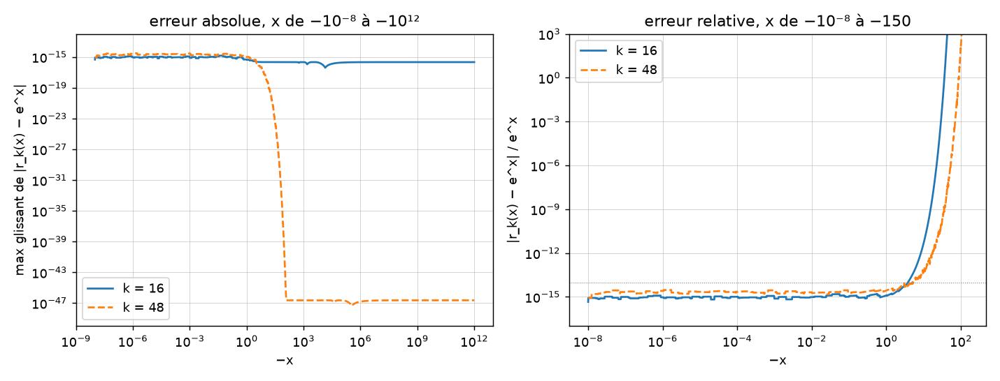

<!-- généré par verification/scripts/cram_python.py -->
# CRAM : contrôle indépendant des coefficients et comparaison à expm

Coefficients relus dans `src/cram_coefficients.cpp` (source : Pusa 2016, forme IPF). Référence scalaire : mpmath à 30 chiffres ; référence matricielle : oracle mpmath (`verification/V1_analytic_bateman/oracle_ra226.csv`).

## 1. Scalaire : r_k(x) contre e^x sur l'axe négatif

| x | e^x | erreur abs. k=16 | rel. k=16 | erreur abs. k=48 | rel. k=48 |
|---|---|---|---|---|---|
| -1e-06 | 1.000e+00 | 0.0e+00 | 0.0e+00 | 0.0e+00 | 0.0e+00 |
| -0.1 | 9.048e-01 | 2.2e-16 | 2.5e-16 | 4.4e-16 | 4.9e-16 |
| -1 | 3.679e-01 | 3.3e-16 | 9.1e-16 | 2.2e-16 | 6.0e-16 |
| -5 | 6.738e-03 | 1.9e-16 | 2.8e-14 | 1.4e-17 | 2.1e-15 |
| -10 | 4.540e-05 | 1.8e-16 | 4.0e-12 | 4.1e-20 | 9.0e-16 |
| -20 | 2.061e-09 | 1.7e-16 | 8.2e-08 | 4.5e-24 | 2.2e-15 |
| -30 | 9.358e-14 | 8.1e-17 | 8.6e-04 | 3.2e-28 | 3.4e-15 |
| -40 | 4.248e-18 | 2.1e-16 | 5.0e+01 | 1.7e-32 | 4.0e-15 |
| -60 | 8.757e-27 | 1.8e-16 | 2.1e+10 | 1.1e-40 | 1.3e-14 |
| -100 | 3.720e-44 | 5.3e-17 | 1.4e+27 | 2.2e-47 | 5.9e-04 |
| -1e+03 | 0.000e+00 | 9.9e-17 | — | 6.9e-48 | — |
| -1e+06 | 0.000e+00 | 2.1e-16 | — | 1.5e-47 | — |
| -1e+12 | 0.000e+00 | 2.1e-16 | — | 2.3e-47 | — |

- k = 16 : erreur absolue max 1.47e-15 (en x = -0.0351), α₀ = 2.125e-16 (valeur de r_k en −∞, plancher de l'erreur absolue).
- k = 48 : erreur absolue max 2.97e-15 (en x = -1.07e-06), α₀ = 2.258e-47 (valeur de r_k en −∞, plancher de l'erreur absolue).

Lecture : l'erreur *absolue* est bornée partout (c'est la définition de l'approximation de Tchebychev sur ]−∞, 0]) ; l'erreur *relative* explose dès que e^x descend sous le plancher α₀. Pour k = 16 cela arrive vers x = −30 (e^x ≈ 10⁻¹³) ; pour k = 48, vers x = −100 (10⁻⁴⁴). Une population très petite devant la population initiale n'est donc résolue qu'en absolu.

## 2. Matriciel : chaîne du Ra-226 (15 nucléides) contre l'oracle mpmath

Écart maximal sur les 15 populations, par méthode. Relatif : populations ≥ 10⁻³⁰ ; absolu : toutes (population totale = 1). CRAM ici : résolution LU dense NumPy, indépendante de la substitution avant du C++.

| cas | ‖At‖₁ | expm SciPy rel. | CRAM-16 rel. | CRAM-16 abs. | CRAM-48 rel. | CRAM-48 abs. |
|---|---|---|---|---|---|---|
| ra226_30j | 2.2e+10 | 1.9e-07 | 5.5e-11 | 8.9e-16 | 1.2e-15 | 3.3e-16 |
| ra226_1a | 2.7e+11 | 1.7e-06 | 2.5e-12 | 4.4e-16 | 6.7e-16 | 1.6e-19 |
| ra226_100a | 2.7e+13 | 1.4e-04 | 1.4e-14 | 4.4e-16 | 6.7e-16 | 2.2e-16 |

Lecture : expm perd un chiffre par facteur 2 de ‖At‖ (mise à l'échelle puis élévations au carré) : 10⁻⁷ à 30 j, 10⁻⁴ à 100 a. CRAM ne met rien à l'échelle : k/2 résolutions linéaires, erreur indépendante de t. L'ordre 16 est limité *en relatif* par son plancher absolu 2·10⁻¹⁶ sur les petites populations (Pb-206 à 30 j : 3·10⁻⁵) ; l'ordre 48 est à l'arrondi près partout.

