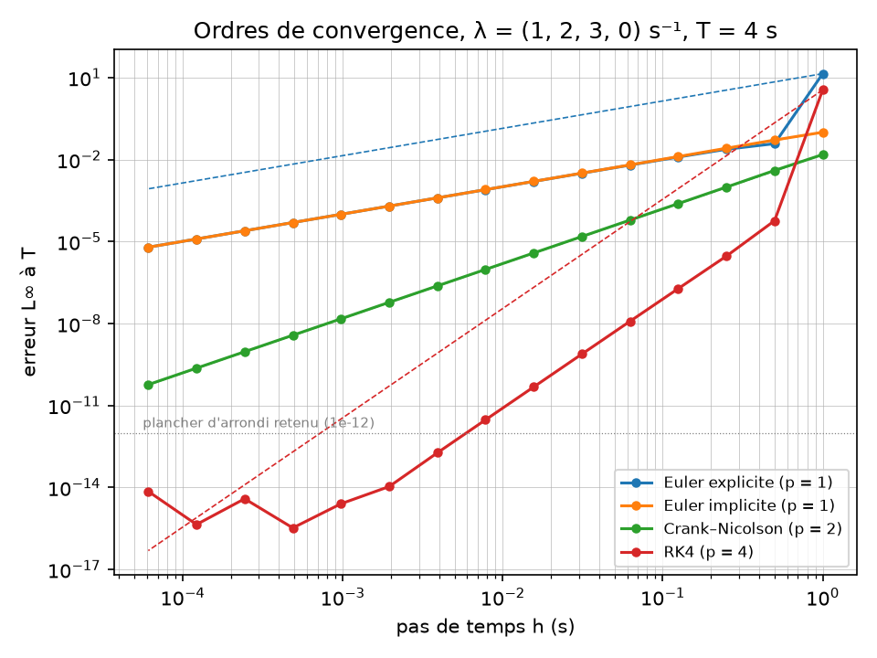
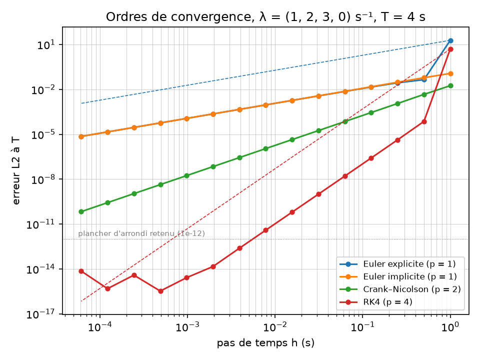

# Rapport de vérification — decaysolver 0.1.0

*Version du code : voir l'en-tête de provenance des sorties (SHA git). Données : ICRP-107 via
`data/nuclides_icrp107.csv`, SHA-256 dans `data/PROVENANCE.md`. Généré le 2026-09-05.*

## 0. Objet et vocabulaire

Ce rapport établit que decaysolver **fait ce que l'on a voulu qu'il fasse** : réalisation
informatique et numérique correcte des équations de Bateman. C'est une **vérification** au sens
du guide ASN n°28, pris comme référentiel méthodologique d'inspiration (le guide vise formellement
les outils de la démonstration de sûreté, ce que ce solveur n'est pas). La **validation**, c'est-à-
dire la représentation satisfaisante de la physique, relève de l'évaluation croisée avec un outil
de référence (`validation/`, lot 4) et n'est pas traitée ici.

Tous les cas de validation analytiques ci-dessous ont pour référence un **oracle multiprécision**
(mpmath, 50 chiffres) produit par des scripts versionnés dans `verification/scripts/`, qui
évaluent la formule fermée de Bateman, et non des différences divisées : deux implémentations,
deux arithmétiques.

## 1. Matrice phénomène × cas de test

| Phénomène / propriété | Cas | Niveau | Emplacement | Résultat |
|---|---|---|---|---|
| Décroissance simple | N₀ e^{−λt}, une demi-vie de Co-60 | T2 | `test_bateman.cpp`, `test_inventory.cpp` | écart ≤ 1e-15 |
| Filiation à deux corps | formule fermée, Sr-90/Y-90 à 30 j | T2 | `test_bateman.cpp` | ≤ 1e-13 |
| Équilibre séculaire | A_Y/A_Sr = λ_Y/(λ_Y − λ_Sr) à 1 a | T2 | `test_bateman.cpp` | ≤ 1e-12 |
| Chaîne courte vs oracle | (1,2,3,0), T = 4 s | T2/V1 | `test_oracle_cases.cpp` | ≤ 1e-13 |
| **Chaîne réelle vs oracle** | Ra-226 → Pb-206, 15 nucléides, 30 j / 1 a / 100 a | T2/V1 | `test_oracle_cases.cpp` | **écart max 4,0e-13** (Pb-206 à 30 j) |
| Dégénérescence exacte | D1, λ = (1,1) | T5 | `test_bateman.cpp` | ≤ 1e-14 |
| Quasi-dégénérescence | D2 (1e-7), D3 (1e-11) | T5 | `test_bateman.cpp` | ≤ 1e-12 |
| **Limitation : formule naïve** | D2, D3 | T5 `[known-limitation]` | `test_bateman.cpp` | erreur 2e-3 ; **résultat 0,0** |
| Condition initiale | N(0) = N₀ bit à bit, filles exactement 0 | T4 | `test_bateman.cpp` | exact |
| Positivité | Sr-90, 4 échéances jusqu'à 10⁴ a | T4 | `test_bateman.cpp` | N ≥ 0 |
| Conservation, données exactes | Sr-90 (rapports = 1) | T4 | `test_bateman.cpp` | ≤ 1e-14 |
| Conservation, données ICRP-107 | Ra-226 sur 1100 a | T4 | `test_bateman.cpp` | ≤ 1e-5 (arrondis des rapports, voir §4) |
| Semi-groupe | Φ(1100 a) = Φ(1000 a)∘Φ(100 a), Ra-226 | T4 | `test_bateman.cpp` | ≤ 1e-10 |
| Ordres de convergence | 4 schémas, (1,2,3,0), 15 raffinements | T3/V2 | `decaysolver_convergence` | §2 |
| Raideur : L-stabilité | Rn-222, h = 1 a, Euler implicite | T5/D5 | `test_integrator.cpp` | positif, conservatif |
| Raideur : non-L-stabilité | Crank–Nicolson, même cas | T5/D5 | `test_integrator.cpp` | N = R(z) N₀ < 0 |
| Raideur : instabilité | Euler explicite, même cas | T5/D5 | `test_integrator.cpp` | divergence |
| Données : invariants | Σ b = 1 à 5e-4, filles présentes, acyclicité, sur les 139 nucléides | T1 | `test_nuclide_library.cpp` | passe |

## 2. Ordres de convergence (V2)

Problème non raide : λ = (1, 2, 3, 0) s⁻¹, N(0) = (1, 0, 0, 0), T = 4 s (h·λ_max ≤ 0,75 dès 16
pas : on mesure l'ordre nominal, pas la réduction d'ordre des problèmes raides). Pas h_k = T/2^k,
k = 2 à 16. Erreur à T sur le vecteur des populations, normes L∞ et L2, contre l'oracle mpmath.
Ordre observé p_obs = log₂(E_k / E_{k+1}).

**Critère d'acceptation** : au moins quatre p_obs consécutifs dans [p − 0,1 ; p + 0,1] parmi les
raffinements dont l'erreur reste au-dessus du plancher d'arrondi retenu, 10⁻¹². Il est vérifié
automatiquement par l'exécutable `decaysolver_convergence` (code de retour), lancé par ctest et
par un job CI dédié.

| Schéma | p théorique | p_obs (L∞), plage valide | Suite valide L∞ / L2 | Verdict |
|---|---|---|---|---|
| Euler explicite | 1 | 1,00 de k = 4 à 15 | 12 / 12 | OK |
| Euler implicite | 1 | 1,00 de k = 2 à 15 | 14 / 14 | OK |
| Crank–Nicolson | 2 | 2,000 de k = 4 à 15 (1,93 à k = 2) | 14 / 14 | OK |
| RK4 | 4 | 3,95 à 4,01 de k = 4 à 9 | 5 / 6 | OK |





Tableaux complets (15 raffinements × 4 schémas, générés) : [`convergence_tables.md`](convergence_tables.md).
Données brutes : [`convergence_results.csv`](../V2_order_of_accuracy/convergence_results.csv).

### 2.1 Le piège du plancher d'arrondi, mesuré

Pour RK4, l'erreur atteint 1,9·10⁻¹³ à k = 10 (1024 pas) puis **l'ordre observé s'effondre** :
2,1 à k = 11, 2,9 à k = 12, −3,5 à k = 13. À partir de 10⁻¹⁴ l'erreur d'arrondi (≈ 10⁻¹⁶ par
opération, quelques milliers d'opérations) domine la troncature, et l'erreur remonte même
légèrement avec le nombre de pas (7·10⁻¹⁵ à k = 16). C'est le comportement attendu, et la raison
pour laquelle le critère borne la plage de raffinement au lieu d'exiger l'ordre partout. Les
schémas d'ordre 1 et 2 n'atteignent pas ce plancher avant k = 16 (erreurs finales 6·10⁻¹¹ pour
Crank–Nicolson, 10⁻⁵ pour Euler).

Point remarquable à k = 2 pour RK4 : h = 1 s, h·λ_max = 3 > 2,785, hors du domaine de stabilité,
erreur 3,6 (le schéma diverge). Le premier raffinement (k = 3, h·λ = 1,5) revient dans le domaine
et l'ordre 4 s'établit dès k = 4.

### 2.2 Pourquoi l'exponentielle de matrice n'est pas dans ce tableau

Sur un système linéaire à coefficients constants, la solution exacte est N(t) = e^{At} N₀ : une
exponentielle de matrice correctement calculée n'a pas d'erreur de troncature en h, son erreur ne
décroît pas avec le pas. Elle fait l'objet d'une comparaison directe (lot 3, côté Python, SciPy)
et non d'une mesure d'ordre.

## 3. Solution analytique vs oracle (V1)

**Chaîne du Ra-226** (Ra-226 → Rn-222 → Po-218 → Pb-214 / At-218 → Bi-214 → Po-214 / Tl-210 →
Pb-210 → Bi-210 → Po-210 / Tl-206 → Pb-206, 15 nucléides, toutes voies ICRP-107, N(Ra-226)(0) = 1).
Constantes de 4,2·10³ s⁻¹ (Po-214) à 0 (Pb-206) : **14 ordres de grandeur**, soit une raideur
S ≈ 3·10¹⁴ sur les membres radioactifs. Écart relatif maximal entre decaysolver (différences
divisées, `double`) et l'oracle (formule fermée, 50 chiffres) sur les 45 valeurs :
**3,97·10⁻¹³** (Pb-206 à 30 j, population 3·10⁻⁵). Les populations inférieures à 10⁻³⁰ (Po-214,
Tl-210 à 30 j, sans signification physique pour une population totale de 1) sont comparées en
absolu à 10⁻⁴⁰.

**Ce résultat est le contre-exemple honnête du cahier des charges :** la raideur ne dégrade pas la
formule analytique. Ce sont les constantes *proches*, pas les constantes *étalées*, qui la
détruisent (§1, D2–D3). Deux pathologies indépendantes.

## 4. Domaine de validité chiffré

| Quantité | Domaine | Précision attendue | Preuve |
|---|---|---|---|
| Solution analytique, constantes distinctes | λ_max/λ_min jusqu'à 10¹⁴ testé, chaînes ≤ 15 nucléides | ≤ 10⁻¹² relatif | V1 Ra-226 (4·10⁻¹³) |
| Solution analytique, constantes proches ou égales | écarts relatifs de 0 à 10⁻⁷ testés (D1–D3) | ≤ 10⁻¹² relatif | T5 |
| Conservation du nombre d'atomes | données à rapports exacts | ≤ 10⁻¹⁴ | T4 Sr-90 |
| Conservation, données ICRP-107 | toute chaîne | bornée par max |Σb − 1| = 6·10⁻⁵ et par les voies SF non suivies (≤ 1,4·10⁻⁶) | T4 Ra-226, T1 |
| Euler implicite | tout h > 0, y compris h·λ ≫ 1 | ordre 1 ; positivité et conservation garanties | V2, T5 |
| Crank–Nicolson | h·λ_max ≲ 2 recommandé | ordre 2 ; **N < 0 possible** si h·λ ≫ 1 | V2, T5 |
| RK4 | h·λ_max ≤ 2,785 | ordre 4 jusqu'à E ≈ 10⁻¹³ | V2 |
| Euler explicite | h·λ_max ≤ 2 (positivité : ≤ 1) | ordre 1 | V2, T5 |
| Mode inventaire | 35 nucléides de la liste standard + descendants | limité par les **données**, pas par la numérique (voir ci-dessous) | T2, T8 privé |

**Limite dominante : les données.** ICRP-107 ne fournit pas d'incertitude sur les demi-vies ; les
évaluations divergent entre bibliothèques (Cs-137 : 30,17 a ICRP-107, 30,05 a DDEP 2006, 30,08 a
ENSDF 2020 ; Sn-121m : 43,9 a contre 55 a avant 2000). Ces écarts, de 10⁻³ à 2·10⁻¹, dépassent de
dix ordres de grandeur l'erreur numérique. La précision d'un inventaire vieilli est celle de sa
bibliothèque de demi-vies, et decaysolver la recopie dans chaque sortie pour qu'on sache laquelle.

## 5. Limitations connues

- Formule fermée de Bateman non protégée : pathologie d'annulation documentée par un test dédié
  (`[known-limitation]`), jamais utilisée pour un calcul.
- Produit λ₀⋯λ_{k−1} d'un chemin : descend vers 10⁻¹⁰⁰ sur la série de l'U-238 ; dans la plage du
  `double` (10⁻³⁰⁸), mais non protégé pour des chaînes plus longues ou des constantes plus petites.
- Conservation sur données réelles limitée par les arrondis des rapports d'embranchement de la
  source (§4), délibérément non renormalisée.
- Ordres de convergence mesurés sur un problème non raide uniquement ; en régime raide, seul
  l'Euler implicite est utilisable, et son ordre effectif n'est pas mesuré ici.
- Aucune propagation d'incertitude sur λ (données sans incertitudes).
- Pas de PDF : ce rapport est le fichier Markdown du dépôt, figures incluses.

## 6. Reproduire

```bash
python verification/scripts/oracle_convergence.py      # oracle_lambda123.csv
python verification/scripts/oracle_ra226.py            # oracle_ra226.csv
cmake --preset release && cmake --build --preset release
./build/release/verification/decaysolver_convergence verification/V2_order_of_accuracy/oracle_lambda123.csv out.csv
python verification/scripts/plot_convergence.py out.csv  # figures + convergence_tables.md
ctest --preset release                                 # T1–T5, V1, V2
```
